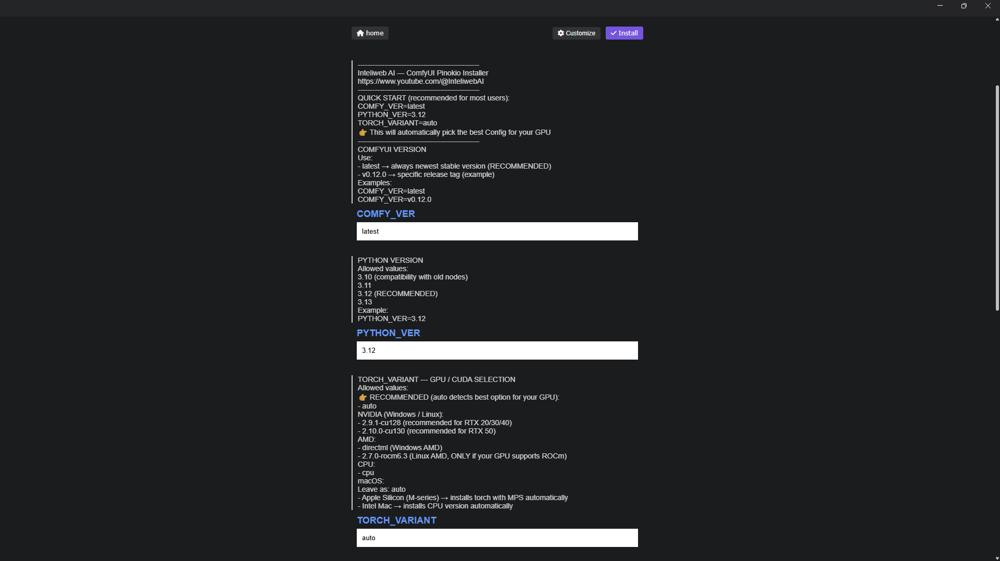

# 🚀 Inteliweb ComfyUI Installer (Pinokio)

One-click ComfyUI installer with automatic GPU detection and PyTorch
setup for NVIDIA, AMD and macOS.\
Designed for fast, reproducible AI workflows with optimized defaults by
Inteliweb AI.

---

## 🖼️ Configuration Interface

---

## ✨ Features

✅ Automatic GPU detection (RTX 20/30/40/50, AMD, Apple Silicon)\
✅ Smart PyTorch & CUDA selection (cu128 / cu130 / DirectML / ROCm / CPU)\
✅ Works on Windows, Linux and macOS\
✅ Clean, reproducible environment\
✅ Ready-to-use ComfyUI workflows included\
✅ Beginner friendly --- advanced ready

------------------------------------------------------------------------

## ⚡ Quick Start (Recommended)

Leave everything as default:

COMFY_VER=latest\
PYTHON_VER=3.12\
TORCH_VARIANT=auto

👉 The installer will automatically select the best configuration for
your GPU.

------------------------------------------------------------------------

## 🧠 Torch Variant Options

### Recommended

auto

### NVIDIA GPUs

2.9.1-cu128 --- RTX 20/30/40\
2.10.0-cu130 --- RTX 50

### AMD GPUs

directml --- Windows\
2.7.0-rocm6.3 --- Linux ROCm

### CPU

cpu

### macOS

Leave TORCH_VARIANT=auto\
Apple Silicon → MPS\
Intel Mac → CPU

------------------------------------------------------------------------

## 🖥️ Supported Platforms

Windows --- NVIDIA / AMD / CPU\
Linux --- NVIDIA / AMD (ROCm optional) / CPU\
macOS --- Apple Silicon (MPS) / CPU

------------------------------------------------------------------------

## 📦 What's Included

Automated ComfyUI installation\
PyTorch & CUDA setup\
Environment isolation\

------------------------------------------------------------------------

## 📺 Learn More

https://www.youtube.com/@InteliwebAI

------------------------------------------------------------------------

Built with ❤️ by Inteliweb AI
